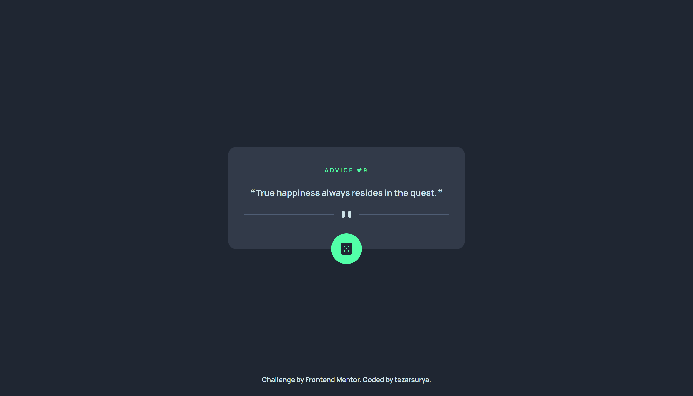
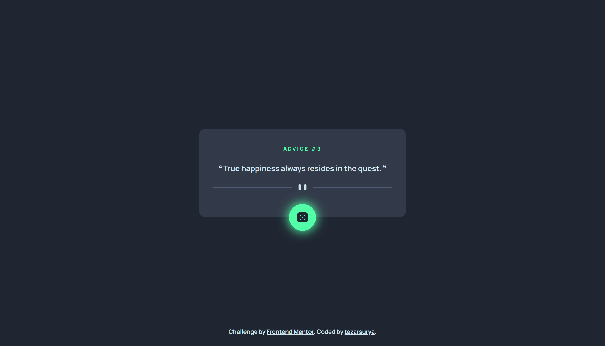
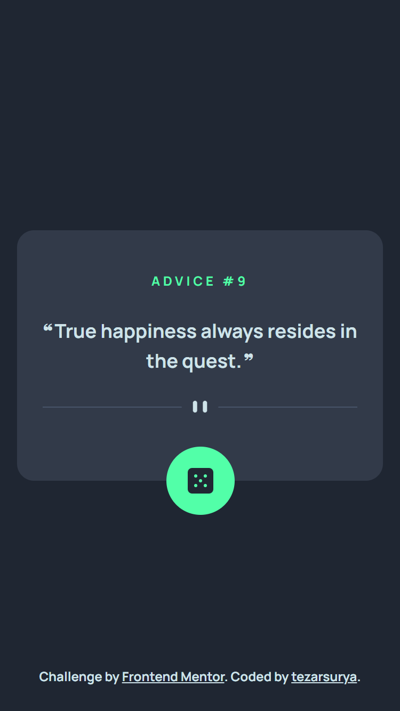

# Frontend Mentor - Advice generator app solution

This is a solution to the [Advice generator app challenge on Frontend Mentor](https://www.frontendmentor.io/challenges/advice-generator-app-QdUG-13db). Frontend Mentor challenges help you improve your coding skills by building realistic projects.

## Table of contents

- [Frontend Mentor - Advice generator app solution](#frontend-mentor---advice-generator-app-solution)
  - [Table of contents](#table-of-contents)
  - [Overview](#overview)
    - [The challenge](#the-challenge)
    - [Screenshot](#screenshot)
    - [Links](#links)
  - [My process](#my-process)
    - [Built with](#built-with)
  - [Author](#author)

## Overview

### The challenge

Users should be able to:

- View the optimal layout for the app depending on their device's screen size
- See hover states for all interactive elements on the page
- Generate a new piece of advice by clicking the dice icon

### Screenshot

### Links

- Solution URL: [My Solution](https://www.frontendmentor.io/solutions/built-with-vite-react-and-tailwindcss-using-mobilefirst-workflow-gmG-9lFE2B)
- Live Site URL: [advice-generator-tezarsurya.vercel.app](https://advice-generator-tezarsurya.vercel.app/)

## My process

### Built with

- Mobile-first workflow
- Vite
- React
- Tailwindcss

## Author

- Frontend Mentor - [@tezarsurya](https://www.frontendmentor.io/profile/tezarsurya)
- Instagram - [@tezarsurya](https://www.instagram.com/tezarsurya)
